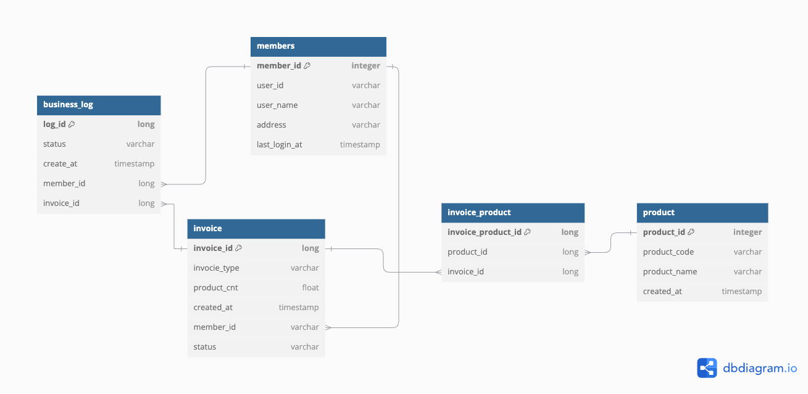

# [금 거래 웹 서비스]
금방주식회사 백엔드 입사과제

 

## 목차
- [개요](#개요)
- [시나리오](#시나리오)
- [기술 스택](#기술-스택)
- [데이터베이스 모델링](#데이터베이스-모델링)
- [API 명세](#API-명세)
- [구현 기능](#구현-기능)

 

## 개요
- 금 거래 웹 서비스
- 개발기간 : 2024.09.4 ~ 2024.09.11
   

## 시나리오
1. 사용자 회원가입 후 인증서버 요청
2. 인증 이후 발급받은 accesstoken을 사용하여 자원 요청 API 호출
3. token 기간 만료 시 refreshToken을 통해 인증 서버 재발급 요청
    

## 기술 스택
언어 및 프레임워크:   
데이터 베이스:   
기타 :   
 

## 데이터베이스 모델링

 

## API 명세
1. 로그인 /api/login **POST**
2. 회원가입 /api/join **POST**
3. 토큰 재발급 /api/reissue-jwt **GET**
4. 상품 주문(판매/구매) 요청 /api/orders/{orderType} **POST**
5. 상품 거래 상태 변경 요청 /api/orders/modStatus **PATCH**

 

## 구현 기능
1. 회원가입 요청 시 인증 서버로 grpc 요청, 인증서버 DB 사용자 정보(전체:id, pw,주소, 생년월일) 저장, 자원서버 DB 사용자 일부(id, pw, 주소) 정보 저장
2. 로그인 요청 시 인증 서버로 grpc 요청, 인증서버에서 발급한 access token, refresh token 반환 
   1. access token : userid, address 
   2. refresh token : userid
3. 토큰 기간 만료 시 인증서버로 재발급 요청
    

